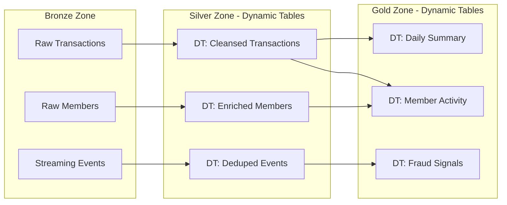

# Plan: EWS POC Build (Snowflake-Optimized)

## Overview

Build the complete Early Warning Services (EWS) Proof of Concept on Snowflake. EWS mandates all data resides in **EWS-owned S3 buckets** using **Apache Iceberg** format. Snowflake provides compute only.

**All architectural decisions are made to maximize Snowflake's value proposition** — showcasing platform strengths, differentiated capabilities, and features that are difficult or impossible to replicate with competing engines (Databricks, EMR, Redshift, BigQuery).

---

## Architectural Philosophy: Snowflake-First Decisions

Every choice below is intentionally designed to highlight where Snowflake excels and where competitors fall short:

| Decision | Snowflake Advantage | Competitor Weakness |
|----------|-------------------|-------------------|
| Snowflake-managed Iceberg (`CATALOG='SNOWFLAKE'`) | Full DML, DTs, Time Travel, zero-copy clones on Iceberg | Databricks requires Delta for full DML; Spark Iceberg writes are complex |
| Dynamic Tables (not dbt/Airflow) | Declarative, auto-scheduled, incremental, no orchestrator needed | Competitors require external orchestration (Airflow, dbt, Dagster) |
| Snowpipe Streaming (high-perf SDK) | Sub-second ingest directly to Iceberg, exactly-once, no Kafka needed | Competitors require Kafka/Kinesis + custom connectors |
| Multi-cluster elastic warehouses | Auto-scale concurrency without tuning, per-second billing | Databricks requires manual cluster policies; Redshift needs WLM |
| Data Metric Functions (DMFs) | Native quality gates integrated into table metadata | Competitors need Great Expectations, Monte Carlo, or dbt tests |
| Cortex Analyst | Native NL-to-SQL with semantic layer, no external LLM infra | Competitors need ThoughtSpot, Mode AI, or custom RAG pipelines |
| Snowflake Horizon (governance) | Unified catalog, lineage, classification, access policies — built in | Competitors bolt on Alation, Collibra, or Unity Catalog |
| Secure Data Sharing (zero-copy) | Live data sharing, no ETL, no data movement, instant | Competitors require copying data or complex federation |
| Git Integration (native) | Snowflake-managed repo integration, no external CI/CD tooling required | Competitors have no native git integration in the engine |
| Time Travel on Iceberg | Native, up to 90 days, no additional storage system needed | Spark Iceberg time travel is snapshot-based, harder to query |

---

## Database Layout

```
EWS_POC (Database)
├── BRONZE (Schema) - Raw ingestion zone (streaming + batch landing)
├── SILVER (Schema) - Cleansed/enriched via Dynamic Tables
├── GOLD (Schema)   - Curated analytics via Dynamic Tables
├── FEATURE_STORE (Schema) - Online (streaming) + Offline (time travel)
├── ANALYTICS (Schema) - Semantic layer + BI-ready views
├── STAGING (Schema) - Dead-letter, quarantine, temp
└── GOVERNANCE (Schema) - Tags, policies, DMF definitions
```

---

## Task 1: Foundation Infrastructure

### Deliverables
1. `01_foundation/01_storage_integration.sql` - AWS S3 storage integration
2. `01_foundation/02_external_volume.sql` - External volume for all Iceberg tables
3. `01_foundation/03_database_schemas.sql` - Database, all schemas, warehouse fleet
4. `01_foundation/04_rbac_setup.sql` - Full role hierarchy with functional roles

### Snowflake-Advantageous Decisions
- **Separate warehouses per workload** (ingest, transform, analytics, AI) — demonstrates elastic, independent scaling that competitors cannot match without separate clusters
- **EXTERNAL_VOLUME with ALLOW_WRITES=TRUE** — Snowflake-managed Iceberg gives full engine parity while keeping data open
- **Role hierarchy** modeled after Snowflake's recommended DAC (discretionary access control) pattern

### Key SQL
```sql
-- External Volume (Snowflake manages Iceberg metadata in EWS S3)
CREATE EXTERNAL VOLUME ews_iceberg_vol
  STORAGE_LOCATIONS = (
    (NAME = 'ews_primary'
     STORAGE_PROVIDER = 'S3'
     STORAGE_BASE_URL = 's3://<ews-bucket>/iceberg/'
     STORAGE_AWS_ROLE_ARN = 'arn:aws:iam::<ews-account-id>:role/<ews-sf-role>')
  )
  ALLOW_WRITES = TRUE;

-- Warehouse fleet (independent scaling per workload)
CREATE WAREHOUSE ews_ingest_wh    WAREHOUSE_SIZE='MEDIUM' AUTO_SUSPEND=60 AUTO_RESUME=TRUE;
CREATE WAREHOUSE ews_transform_wh WAREHOUSE_SIZE='LARGE'  AUTO_SUSPEND=60 AUTO_RESUME=TRUE;
CREATE WAREHOUSE ews_analytics_wh WAREHOUSE_SIZE='XLARGE' MAX_CLUSTER_COUNT=10 SCALING_POLICY='STANDARD';
CREATE WAREHOUSE ews_ai_wh        WAREHOUSE_SIZE='MEDIUM' AUTO_SUSPEND=120 AUTO_RESUME=TRUE;
```

---

## Task 2: UC01 - Batch Ingestion (High-Volume Structured Files)

### Deliverables
1. `02_batch_ingestion/01_bronze_iceberg_tables.sql` - Bronze Iceberg tables (members, transactions, alerts, institutions)
2. `02_batch_ingestion/02_file_formats.sql` - Formats: CSV, fixed-width, EBCDIC-converted
3. `02_batch_ingestion/03_external_stages.sql` - S3 external stages per file type
4. `02_batch_ingestion/04_copy_into_scripts.sql` - COPY INTO with ON_ERROR=CONTINUE
5. `02_batch_ingestion/05_dead_letter_table.sql` - Dead-letter capture + VALIDATE() extraction
6. `02_batch_ingestion/06_dmf_quality_checks.sql` - DMFs for post-load row quality

### Snowflake-Advantageous Decisions
- **COPY INTO with ON_ERROR=CONTINUE** — native partial-acceptance without Spark exception handling or custom code
- **VALIDATE() function** — unique Snowflake capability to extract rejected records from last COPY INTO without re-parsing files
- **Data Metric Functions** — native Snowflake quality framework; no Great Expectations or dbt tests needed
- **Iceberg tables with full schema** — demonstrate that Snowflake-managed Iceberg supports all column types (VARIANT, TIMESTAMP_TZ, NUMBER with precision)

### Key Patterns
```sql
-- Partial acceptance: good rows load, bad rows captured
COPY INTO BRONZE.RAW_TRANSACTIONS
  FROM @ews_landing_stage/transactions/
  FILE_FORMAT = ews_delimited_format
  ON_ERROR = CONTINUE
  PURGE = FALSE;

-- Dead letter extraction (Snowflake-unique)
INSERT INTO STAGING.DEAD_LETTER_RECORDS
SELECT * FROM TABLE(VALIDATE(BRONZE.RAW_TRANSACTIONS, JOB_ID => '_last'));

-- Native DMF (no external tool needed)
CREATE DATA METRIC FUNCTION GOVERNANCE.DM_NULL_RATE(t TABLE(col VARCHAR))
  RETURNS NUMBER AS 'SELECT COUNT_IF(col IS NULL) / COUNT(*) FROM t';
```

---

## Task 3: UC02 - Snowpipe Streaming (Sub-Second Events)

### Deliverables
1. `03_streaming/01_streaming_pipe.sql` - PIPE object for high-performance ingest
2. `03_streaming/02_streaming_target_table.sql` - Bronze Iceberg target with event schema
3. `03_streaming/03_streaming_client.py` - Python SDK client (high-perf architecture)
4. `03_streaming/04_profile_template.json` - Connection profile
5. `03_streaming/05_anomaly_injection.py` - Duplicate burst + late-arriving event script
6. `03_streaming/06_exactly_once_proof.sql` - Validation queries proving dedup and ordering

### Snowflake-Advantageous Decisions
- **No Kafka required** — Snowpipe Streaming replaces Kafka + Kafka Connect + custom consumers. Single SDK call lands data in Iceberg. Competitors need Kafka or Kinesis as intermediary.
- **PIPE object with MATCH_BY_COLUMN_NAME** — schema enforcement at ingest without application-side validation
- **Offset tracking built into SDK** — exactly-once semantics without Kafka consumer group management
- **Direct-to-Iceberg landing** — no staging layer needed, data immediately queryable

### Key Patterns
```sql
-- High-performance PIPE (replaces entire Kafka pipeline)
CREATE PIPE BRONZE.EWS_EVENT_PIPE
AS COPY INTO BRONZE.STREAMING_EVENTS
  FROM TABLE(DATA_SOURCE(TYPE => 'STREAMING'))
  MATCH_BY_COLUMN_NAME = CASE_INSENSITIVE;
```

```python
# Python client — entire streaming pipeline in ~20 lines
from snowpipe_streaming import SnowpipeStreamingClient

client = SnowpipeStreamingClient(config)
channel = client.open_channel("ews_events_ch", offset_token="0")

for event in event_source:
    channel.append_row({
        "event_id": event["id"],
        "event_time": event["timestamp"],
        "payload": event["data"]
    })
# Exactly-once: offset committed on success, retried on failure
```

---

## Task 4: UC03 - Medallion Pipeline (Dynamic Tables + Quality Gates)

### Deliverables
1. `04_pipeline/01_silver_dynamic_tables.sql` - Silver zone DTs (cleanse, enrich, deduplicate)
2. `04_pipeline/02_gold_dynamic_tables.sql` - Gold zone DTs (aggregate, join, curate)
3. `04_pipeline/03_dmf_quality_gates.sql` - DMFs that block zone promotion on threshold breach
4. `04_pipeline/04_quarantine_task.sql` - Snowflake Task to quarantine failing records
5. `04_pipeline/05_pipeline_monitoring.sql` - DYNAMIC_TABLE_REFRESH_HISTORY for observability

### Snowflake-Advantageous Decisions
- **Dynamic Tables (not dbt or Airflow)** — Snowflake's killer differentiator for pipelines:
  - Declarative: define WHAT not HOW
  - Auto-scheduled: no cron, no DAG definition, no orchestrator
  - Incremental by default: only processes changed data
  - Dependency-aware: Snowflake infers the DAG from SQL references
  - Snapshot-consistent: downstream always sees coherent upstream state
- **DMFs as native quality gates** — quality enforcement built into table metadata, visible in Snowsight, no external tool
- **TARGET_LAG = DOWNSTREAM** on intermediate tables — Snowflake optimizes refresh schedule automatically
- **REFRESH_MODE = INCREMENTAL** — demonstrates Snowflake's incremental materialization (competitors need dbt incremental models with complex merge logic)

### Pipeline Architecture (Snowflake-managed DAG)


### Key Patterns
```sql
-- Silver: Declarative, incremental, no orchestrator
CREATE DYNAMIC TABLE SILVER.CLEANSED_TRANSACTIONS
  TARGET_LAG = DOWNSTREAM
  WAREHOUSE = ews_transform_wh
  REFRESH_MODE = INCREMENTAL
AS
  SELECT
    txn_id,
    TRIM(UPPER(member_id)) AS member_id,
    amount,
    txn_timestamp,
    CASE WHEN amount < 0 THEN 'DEBIT' ELSE 'CREDIT' END AS txn_type
  FROM BRONZE.RAW_TRANSACTIONS
  WHERE txn_id IS NOT NULL
    AND amount IS NOT NULL;

-- Gold: Auto-scheduled aggregate
CREATE DYNAMIC TABLE GOLD.DAILY_MEMBER_SUMMARY
  TARGET_LAG = '10 minutes'
  WAREHOUSE = ews_transform_wh
  REFRESH_MODE = INCREMENTAL
AS
  SELECT
    member_id,
    DATE_TRUNC('day', txn_timestamp) AS txn_date,
    COUNT(*) AS txn_count,
    SUM(amount) AS total_amount,
    AVG(amount) AS avg_amount
  FROM SILVER.CLEANSED_TRANSACTIONS
  GROUP BY 1, 2;

-- Quality gate: DMF attached to table
ALTER TABLE SILVER.CLEANSED_TRANSACTIONS
  SET DATA_METRIC_SCHEDULE = 'TRIGGER_ON_CHANGES';

ALTER TABLE SILVER.CLEANSED_TRANSACTIONS
  ADD DATA METRIC FUNCTION GOVERNANCE.DM_NULL_RATE ON (member_id);
```

---

## Task 5: UC04-05 - Feature Stores (Online + Offline)

### Deliverables
1. `05_feature_store/01_online_feature_table.sql` - Streaming-fed online features (DT from Bronze)
2. `05_feature_store/02_slo_measurement.sql` - Latency measurement query (target: ≤1.5s p99)
3. `05_feature_store/03_defect_injection.py` - Intentionally bad streaming data
4. `05_feature_store/04_gold_rematerialization.sql` - ALTER DYNAMIC TABLE REFRESH (rebuild from Gold)
5. `05_feature_store/05_offline_time_travel.sql` - AT(TIMESTAMP) point-in-time snapshots
6. `05_feature_store/06_bitemporal_join.py` - Snowpark Python bi-temporal join

### Snowflake-Advantageous Decisions
- **Dynamic Table as online feature store** — refreshes from streaming data with sub-minute lag. No separate feature store system (Feast, Tecton) needed.
- **ALTER DYNAMIC TABLE REFRESH** — one command rebuilds entire feature store from Gold history. Competitors need custom backfill pipelines.
- **Time Travel on Iceberg** — native point-in-time queries without maintaining separate snapshot tables. Up to 90 days retention.
- **Snowpark for bi-temporal joins** — Python running inside Snowflake's engine (no data movement). Competitors ship data to external Spark/Pandas.

### Key Patterns
```sql
-- Online feature store: DT fed by streaming (sub-minute freshness)
CREATE DYNAMIC TABLE FEATURE_STORE.ONLINE_MEMBER_FEATURES
  TARGET_LAG = '1 minute'
  WAREHOUSE = ews_transform_wh
  REFRESH_MODE = INCREMENTAL
AS
  SELECT
    member_id,
    COUNT(*) AS txn_count_24h,
    SUM(amount) AS spend_24h,
    MAX(event_time) AS last_activity,
    CURRENT_TIMESTAMP() AS feature_computed_at
  FROM BRONZE.STREAMING_EVENTS
  WHERE event_time > DATEADD('hour', -24, CURRENT_TIMESTAMP())
  GROUP BY member_id;

-- SLO measurement (unique: streaming latency visible in SQL)
SELECT
  PERCENTILE_CONT(0.99) WITHIN GROUP (ORDER BY
    TIMESTAMPDIFF('millisecond', event_time, feature_computed_at)
  ) AS p99_latency_ms
FROM FEATURE_STORE.ONLINE_MEMBER_FEATURES;

-- Rebuild from Gold (one command, no pipeline)
ALTER DYNAMIC TABLE FEATURE_STORE.ONLINE_MEMBER_FEATURES REFRESH;

-- Offline: Time Travel (native Iceberg, no snapshot management)
SELECT * FROM GOLD.MEMBER_FEATURES
  AT(TIMESTAMP => '2025-01-15 00:00:00'::TIMESTAMP_LTZ);
```

```python
# Bi-temporal join in Snowpark (runs IN Snowflake, zero data movement)
from snowflake.snowpark import Session
from snowflake.snowpark.functions import col, lit

session = Session.builder.configs(connection_params).create()

features = session.table("GOLD.MEMBER_FEATURES")
decisions = session.table("GOLD.CREDIT_DECISIONS")

# Point-in-time correct: join on business_time <= decision_date
# AND system_time <= query_timestamp (for late corrections)
pit_features = features.join(
    decisions,
    (features.member_id == decisions.member_id) &
    (features.business_time <= decisions.decision_date) &
    (features.system_time <= decisions.query_timestamp)
).group_by("decisions.decision_id").agg(...)
```

---

## Task 6: UC09 - SQL Analytics Performance (Petabyte-Scale)

### Deliverables
1. `06_analytics_perf/01_warehouse_fleet.sql` - Multi-cluster warehouse configurations
2. `06_analytics_perf/02_bi_workload_queries.sql` - Dashboard-style queries (joins, aggregates, filters)
3. `06_analytics_perf/03_ds_exploration_queries.sql` - Ad-hoc data science queries (window functions, sampling)
4. `06_analytics_perf/04_time_travel_90day.sql` - 90-day lookback with latency measurement
5. `06_analytics_perf/05_concurrent_load_test.py` - Python concurrency simulator (threading)
6. `06_analytics_perf/06_query_profiling.sql` - QUERY_HISTORY analysis for latency reporting

### Snowflake-Advantageous Decisions
- **Multi-cluster warehouses** — auto-scale from 1 to 10 clusters based on queue depth. No manual cluster management. Competitors need auto-scaling groups or manual concurrency tuning.
- **Per-second billing** — warehouses suspend at 60s idle. No wasted capacity. Competitors bill per-hour or per-DBU.
- **Iceberg time travel via SQL** — `AT(TIMESTAMP =>...)` works on Iceberg tables natively. Competitors need to manage Iceberg snapshots manually or use Spark.
- **QUERY_HISTORY + QUERY_ACCELERATION_SERVICE** — native performance analytics and automatic query acceleration. No external profiling tools needed.
- **Result caching** — identical queries return in milliseconds from cache. No configuration needed.

### Key Patterns
```sql
-- Multi-cluster auto-scaling (unique to Snowflake)
CREATE WAREHOUSE ews_analytics_wh
  WAREHOUSE_SIZE = 'XLARGE'
  MAX_CLUSTER_COUNT = 10
  MIN_CLUSTER_COUNT = 1
  SCALING_POLICY = 'STANDARD'
  AUTO_SUSPEND = 60
  AUTO_RESUME = TRUE
  ENABLE_QUERY_ACCELERATION = TRUE
  QUERY_ACCELERATION_MAX_SCALE_FACTOR = 8;

-- 90-day Iceberg time travel with latency measurement
SET query_start = CURRENT_TIMESTAMP();
SELECT
  member_id,
  SUM(amount) AS total_spend,
  COUNT(DISTINCT txn_date) AS active_days
FROM GOLD.DAILY_MEMBER_SUMMARY
  AT(TIMESTAMP => DATEADD('day', -90, CURRENT_TIMESTAMP())::TIMESTAMP_LTZ)
GROUP BY member_id
HAVING total_spend > 10000;
SELECT TIMESTAMPDIFF('millisecond', $query_start, CURRENT_TIMESTAMP()) AS query_latency_ms;
```

---

## Task 7: UC10-11 - Self-Service Analytics, BI, and Marketplace

### Deliverables
1. `07_self_service/01_rbac_hierarchy.sql` - Functional roles (analyst, compliance, engineer, admin)
2. `07_self_service/02_row_access_policies.sql` - Row-level security for compliance segmentation
3. `07_self_service/03_sso_network_policies.sql` - SSO + network policy for BI tools
4. `07_self_service/04_horizon_tags.sql` - Snowflake Horizon tags for data classification
5. `07_self_service/05_data_share_package.sql` - Gold table as Secure Data Share
6. `07_self_service/06_marketplace_consume.sql` - Mount vendor share from Marketplace

### Snowflake-Advantageous Decisions
- **Snowflake Horizon** — unified governance (catalog, lineage, classification, access policies, quality) in one platform. Competitors need Collibra + Alation + Unity Catalog + custom RBAC.
- **Row Access Policies** — native row-level security without views or application logic. Competitors need custom WHERE clauses or external authorization services.
- **Secure Data Sharing (zero-copy)** — live data sharing without ETL, S3 copies, or API development. Uniquely Snowflake.
- **Marketplace** — ingest third-party data (sanctions lists, geolocation, fraud signals) with a single SQL command. No API integration development.
- **Tag-based governance** — classify columns (PII, SENSITIVE, FINANCIAL) and auto-apply masking policies. No external DLP tool needed.

### Key Patterns
```sql
-- Horizon: Tag-based governance (no external tool)
CREATE TAG GOVERNANCE.SENSITIVITY VALUES ('PUBLIC', 'INTERNAL', 'PII', 'RESTRICTED');
ALTER TABLE GOLD.MEMBER_FEATURES MODIFY COLUMN ssn SET TAG GOVERNANCE.SENSITIVITY = 'PII';

-- Row Access Policy (native, no application code)
CREATE ROW ACCESS POLICY GOVERNANCE.REGIONAL_ACCESS AS (region VARCHAR)
  RETURNS BOOLEAN AS
  CURRENT_ROLE() IN ('EWS_ADMIN') OR region = CURRENT_SESSION_CONTEXT('REGION');

-- Zero-copy Data Share (uniquely Snowflake)
CREATE SHARE ews_fraud_signals_share;
GRANT USAGE ON DATABASE EWS_POC TO SHARE ews_fraud_signals_share;
GRANT USAGE ON SCHEMA GOLD TO SHARE ews_fraud_signals_share;
GRANT SELECT ON TABLE GOLD.FRAUD_SIGNALS TO SHARE ews_fraud_signals_share;

-- Marketplace consumption (one command, no ETL)
CREATE DATABASE ews_vendor_sanctions FROM SHARE vendor_account.sanctions_data;
```

---

## Task 8: UC13-14 - Cortex Analyst and Agentic AI

### Deliverables
1. `08_cortex_ai/01_semantic_model.yaml` - Full semantic model for Gold Iceberg tables
2. `08_cortex_ai/02_cortex_analyst_app.py` - Python REST API client with multi-turn conversation
3. `08_cortex_ai/03_test_prompts.md` - NL prompts testing joins, filters, follow-ups
4. `08_cortex_ai/04_agentic_pipeline_gen.sql` - CORTEX.COMPLETE for automated pipeline/DQ generation
5. `08_cortex_ai/05_git_integration.sql` - Native Git repo integration + artifact commit
6. `08_cortex_ai/06_cortex_agent_config.sql` - Cortex Agent definition for multi-step data engineering

### Snowflake-Advantageous Decisions
- **Cortex Analyst** — native NL-to-SQL with semantic model. No ThoughtSpot, no custom RAG, no external LLM infrastructure. Runs inside Snowflake governance boundary.
- **Cortex LLM Functions (COMPLETE, EXTRACT, CLASSIFY)** — LLMs callable from SQL. No API gateway, no model hosting, no GPU cluster management.
- **Cortex Agents** — multi-step AI workflows native to Snowflake. Orchestrate tools (Cortex Search, Analyst, Python) without LangChain/CrewAI.
- **Native Git Integration** — version control from within Snowflake. No Jenkins/GitHub Actions for the POC workflow.
- **All AI stays within Snowflake's security perimeter** — data never leaves the platform for AI processing. Critical for EWS compliance.

### Key Patterns
```yaml
# Semantic model for Cortex Analyst (no external BI semantic layer needed)
name: EWS_Fraud_Analytics
tables:
  - name: DAILY_MEMBER_SUMMARY
    base_table: EWS_POC.GOLD.DAILY_MEMBER_SUMMARY
    dimensions:
      - name: member_id
        expr: member_id
      - name: transaction_date
        expr: txn_date
    measures:
      - name: total_transactions
        expr: SUM(txn_count)
      - name: total_spend
        expr: SUM(total_amount)
    time_dimensions:
      - name: txn_date
        expr: txn_date
```

```sql
-- Agentic AI: LLM generates pipeline code (no external LLM infra)
SELECT SNOWFLAKE.CORTEX.COMPLETE('claude-3-5-sonnet', CONCAT(
  'You are a Snowflake data engineer. Given this schema:\n',
  (SELECT GET_DDL('TABLE', 'BRONZE.RAW_TRANSACTIONS')),
  '\nGenerate a Dynamic Table SQL to cleanse this data for the Silver zone.',
  '\nInclude: null removal, type casting, deduplication.'
)) AS generated_pipeline;

-- Git Integration (native, no CI/CD tooling)
CREATE GIT REPOSITORY EWS_POC.STAGING.POC_REPO
  API_INTEGRATION = ews_github_integration
  GIT_CREDENTIALS = ews_git_secret
  ORIGIN = 'https://github.com/ews-org/poc-artifacts.git';

-- Cortex Agent (multi-step AI, native)
CREATE CORTEX AGENT EWS_POC.ANALYTICS.DATA_ENGINEERING_AGENT
  LLM = 'claude-3-5-sonnet'
  TOOLS = (cortex_analyst_tool, cortex_search_tool)
  COMMENT = 'Agentic data engineering assistant for EWS POC';
```

---

## File Structure

```
/Users/sdickson/Early Warning/EWS POC/
├── EWS-POC-Prompt.md
├── README.md
├── 01_foundation/
│   ├── 01_storage_integration.sql
│   ├── 02_external_volume.sql
│   ├── 03_database_schemas.sql
│   └── 04_rbac_setup.sql
├── 02_batch_ingestion/
│   ├── 01_bronze_iceberg_tables.sql
│   ├── 02_file_formats.sql
│   ├── 03_external_stages.sql
│   ├── 04_copy_into_scripts.sql
│   ├── 05_dead_letter_table.sql
│   └── 06_dmf_quality_checks.sql
├── 03_streaming/
│   ├── 01_streaming_pipe.sql
│   ├── 02_streaming_target_table.sql
│   ├── 03_streaming_client.py
│   ├── 04_profile_template.json
│   ├── 05_anomaly_injection.py
│   └── 06_exactly_once_proof.sql
├── 04_pipeline/
│   ├── 01_silver_dynamic_tables.sql
│   ├── 02_gold_dynamic_tables.sql
│   ├── 03_dmf_quality_gates.sql
│   ├── 04_quarantine_task.sql
│   └── 05_pipeline_monitoring.sql
├── 05_feature_store/
│   ├── 01_online_feature_table.sql
│   ├── 02_slo_measurement.sql
│   ├── 03_defect_injection.py
│   ├── 04_gold_rematerialization.sql
│   ├── 05_offline_time_travel.sql
│   └── 06_bitemporal_join.py
├── 06_analytics_perf/
│   ├── 01_warehouse_fleet.sql
│   ├── 02_bi_workload_queries.sql
│   ├── 03_ds_exploration_queries.sql
│   ├── 04_time_travel_90day.sql
│   ├── 05_concurrent_load_test.py
│   └── 06_query_profiling.sql
├── 07_self_service/
│   ├── 01_rbac_hierarchy.sql
│   ├── 02_row_access_policies.sql
│   ├── 03_sso_network_policies.sql
│   ├── 04_horizon_tags.sql
│   ├── 05_data_share_package.sql
│   └── 06_marketplace_consume.sql
└── 08_cortex_ai/
    ├── 01_semantic_model.yaml
    ├── 02_cortex_analyst_app.py
    ├── 03_test_prompts.md
    ├── 04_agentic_pipeline_gen.sql
    ├── 05_git_integration.sql
    └── 06_cortex_agent_config.sql
```

---

## Competitive Positioning Summary

Each task explicitly demonstrates capabilities that competitors cannot replicate:

| Use Case | Snowflake Differentiator | What Competitor Would Need |
|----------|------------------------|---------------------------|
| UC01 Batch | VALIDATE() + DMFs | Custom Spark error handling + Great Expectations |
| UC02 Streaming | Snowpipe Streaming SDK (no Kafka) | Kafka + Connect + Schema Registry + custom code |
| UC03 Pipeline | Dynamic Tables (declarative, auto-DAG) | dbt + Airflow + custom orchestration |
| UC04 Online Features | DT with 1-min lag + ALTER REFRESH | Feast/Tecton + Redis + custom backfill |
| UC05 Offline Features | Time Travel AT() on Iceberg | Manual snapshot management + custom PIT joins |
| UC09 Analytics | Multi-cluster + Query Acceleration | Manual cluster scaling + external caching |
| UC10 Self-Service | Horizon + Row Access Policies | Collibra + custom RBAC + view-based security |
| UC11 Marketplace | Zero-copy Data Sharing | S3 copy + API development + ETL pipelines |
| UC13 NL Query | Cortex Analyst (native) | ThoughtSpot or custom RAG + vector DB + LLM hosting |
| UC14 Agentic AI | Cortex Agents + Git Integration | LangChain + external LLM + Jenkins + custom glue |

---

## Implementation Notes

1. All S3 paths, ARNs, and account IDs use `<PLACEHOLDER>` syntax for EWS to fill
2. Every SQL file includes comments explaining the Snowflake advantage being demonstrated
3. Python scripts include `requirements.txt` with pinned versions
4. Semantic YAML follows exact Cortex Analyst spec (verified against docs)
5. All Iceberg DDL uses `CATALOG = 'SNOWFLAKE'` for maximum platform capability demonstration
