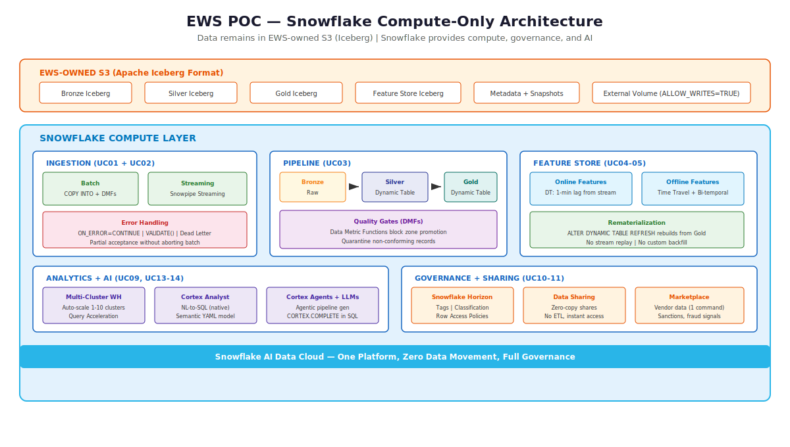
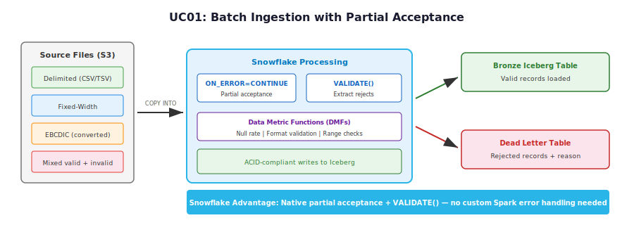
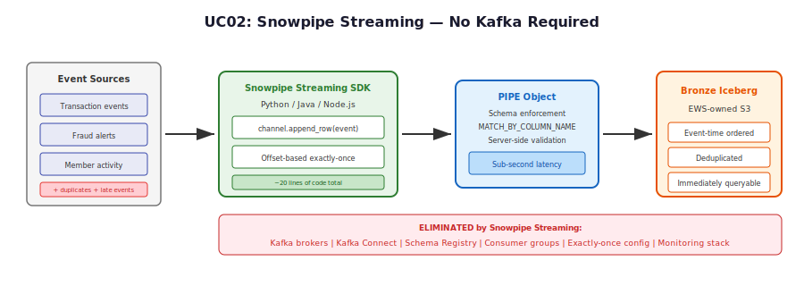
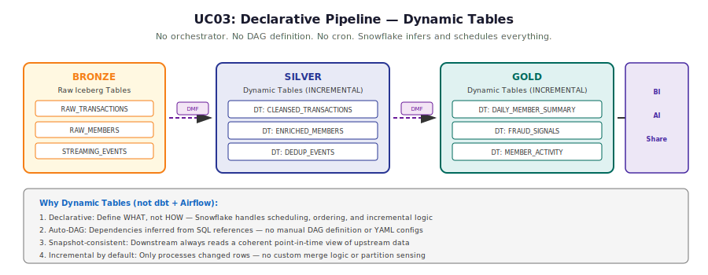
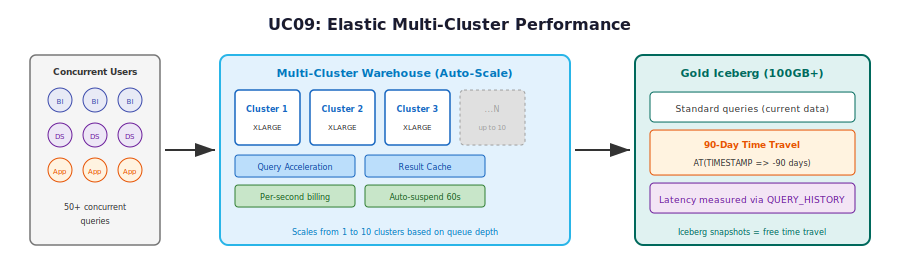
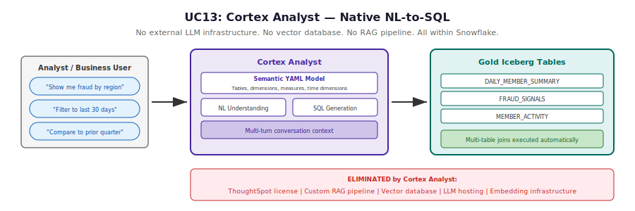
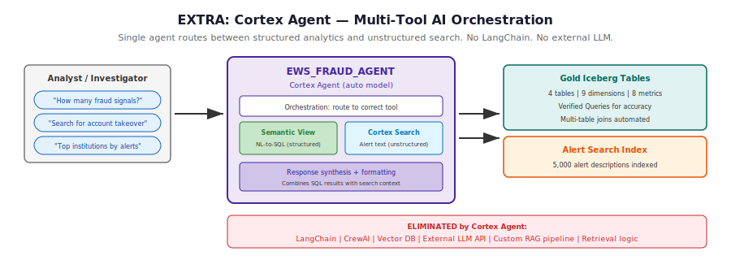
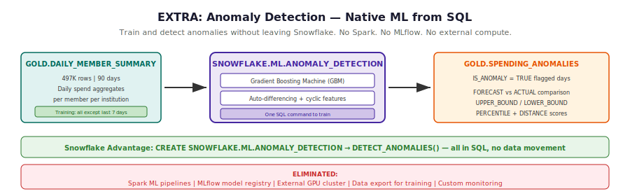
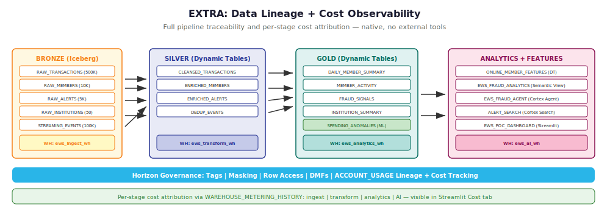

# Early Warning Services (EWS) - Snowflake Proof of Concept

## Executive Summary

This Proof of Concept demonstrates that Snowflake delivers a **complete, unified data platform** for Early Warning Services — replacing dozens of disparate tools with a single engine. All data remains in **EWS-owned S3 buckets** using the **Apache Iceberg** open table format. Snowflake provides compute-only access with full ACID compliance, sub-second streaming, declarative pipelines, native AI, and zero-copy data sharing.

**Architecture Principle:** Every component runs natively within Snowflake. No Kafka. No Airflow. No external feature store. No separate governance tool. No external LLM infrastructure.

---

## Architecture Overview



---

## Use Cases

### UC01: Batch Ingestion — High-Volume Structured File Processing

**Requirement:** ACID-compliant, exactly-once writes to Bronze Iceberg tables from fixed-width, delimited, and EBCDIC bulk file drops. Must support partial-acceptance without aborting the batch.



**Snowflake Capabilities Deployed:**
- `COPY INTO` with `ON_ERROR = CONTINUE` for partial acceptance
- `VALIDATE()` function to extract rejected records (unique to Snowflake)
- Data Metric Functions (DMFs) for post-load quality enforcement
- External Iceberg Tables with full schema support

**What competitors would need:** Custom Spark exception handling + Great Expectations + separate dead-letter infrastructure + manual orchestration.

---

### UC02: Real-Time Streaming Ingestion — Sub-Second Event Processing

**Requirement:** Exactly-once streaming ingest to Bronze Iceberg with event-time ordering. Handle duplicate bursts natively. Single canonical event path — no dual writes.



**Snowflake Capabilities Deployed:**
- Snowpipe Streaming SDK (high-performance architecture)
- PIPE object with server-side schema enforcement
- Offset-based exactly-once delivery semantics
- Direct landing to Iceberg — immediately queryable

**What competitors would need:** Apache Kafka + Kafka Connect + Schema Registry + Consumer Groups + exactly-once configuration + monitoring infrastructure + custom deduplication logic.

---

### UC03: Data Pipeline Framework — Zone-Based Transformation

**Requirement:** Multi-hop Medallion pipeline (Bronze to Silver to Gold) with ACID-guaranteed writes at each zone boundary and quality gate hooks before data advances.



**Snowflake Capabilities Deployed:**
- Dynamic Tables with `REFRESH_MODE = INCREMENTAL`
- `TARGET_LAG = DOWNSTREAM` for optimal scheduling
- Data Metric Functions as quality gates between zones
- Snowflake Tasks for quarantine enforcement

**What competitors would need:** dbt + Airflow (or Dagster/Prefect) + custom incremental logic + manual DAG definitions + separate quality tooling (Great Expectations/Soda).

---

### UC04: Real-Time Online Feature Store — Sub-Second Freshness

**Requirement:** Streaming path for freshness (1.5s p99) and Gold batch path for correctness. Full feature store rebuild from Gold history without stream replay.

**Snowflake Capabilities Deployed:**
- Dynamic Table with `TARGET_LAG = '1 minute'` fed by streaming data
- `ALTER DYNAMIC TABLE ... REFRESH` for one-command rebuild from Gold
- No separate feature store system (Feast, Tecton, Redis)

**What competitors would need:** Feast or Tecton + Redis/DynamoDB for online serving + custom backfill pipelines + separate batch/streaming code paths.

---

### UC05: Offline Feature Store — Point-in-Time Correct Batch Features

**Requirement:** Bi-temporal reconstruction recovering exact feature states at prior decision dates using business time vs. system time.

**Snowflake Capabilities Deployed:**
- Iceberg Time Travel via `AT(TIMESTAMP => ...)` — up to 90-day retention
- Snowpark Python for bi-temporal joins (runs inside Snowflake, no data movement)
- No separate snapshot management system

**What competitors would need:** Manual Iceberg snapshot management + custom point-in-time join frameworks + external compute (Spark/Pandas) with data shipped out.

---

### UC09: SQL Analytics Performance — Petabyte-Scale Complex Queries

**Requirement:** Petabyte-scale query performance on Gold Iceberg under concurrent load. 90-day lookback via Iceberg time travel.



**Snowflake Capabilities Deployed:**
- Multi-cluster warehouses (auto-scale 1 to 10 clusters on queue depth)
- Query Acceleration Service (automatic large-scan optimization)
- Result caching (identical queries return in milliseconds)
- Per-second billing with auto-suspend
- Iceberg Time Travel for 90-day lookback (native, no separate system)

**What competitors would need:** Manual EMR/Databricks cluster autoscaling policies + external caching layers (Redis/Alluxio) + per-hour billing waste + custom snapshot management for time travel.

---

### UC10: Self-Service Analytics and BI Consumption

**Requirement:** UI-based catalog browsability, SQL-first access for non-engineers, and BI connector query push-down with SSO pass-through and RBAC.

**Snowflake Capabilities Deployed:**
- Snowflake Horizon (unified catalog, lineage, classification)
- Row Access Policies (native row-level security, no view hacks)
- Tag-based governance and automatic masking
- SSO + Network Policies for Tableau/Power BI
- Functional role hierarchy following Snowflake best practices

**What competitors would need:** Collibra or Alation (catalog) + custom RBAC views + Apache Ranger (row-level security) + separate classification tools.

---

### UC11: Data Marketplace and Semantic Layer

**Requirement:** Data product registration and ability to ingest vendor marketplace data shares into the EWS environment.

**Snowflake Capabilities Deployed:**
- Secure Data Sharing (zero-copy, live data, no ETL)
- Snowflake Marketplace (consume vendor data with one SQL command)
- No API development, no S3 copies, no data movement

**What competitors would need:** Custom API integrations + S3 copy jobs + ETL pipelines + data reconciliation processes for each vendor feed.

---

### UC13: Conversational Analytics — Natural Language Query

**Requirement:** Natural language to SQL generation against Gold Iceberg tables with multi-table joins and conversational refinement.



**Snowflake Capabilities Deployed:**
- Cortex Analyst with semantic YAML model
- Multi-turn conversational context
- REST API for programmatic access
- All processing within Snowflake governance boundary

**What competitors would need:** ThoughtSpot ($$$) or custom RAG pipeline (vector DB + embeddings + LLM hosting + prompt engineering + retrieval logic).

---

### UC14: Agentic AI for Data Engineering

**Requirement:** LLM-driven orchestration of data engineering tasks subject to human-in-the-loop review and CI/CD deployment gates.

**Snowflake Capabilities Deployed:**
- `SNOWFLAKE.CORTEX.COMPLETE` — call LLMs from SQL (no external API gateway)
- Cortex Agents — multi-step AI orchestration native to Snowflake
- Native Git Integration — version control without Jenkins/GitHub Actions
- All AI processing within Snowflake security perimeter (data never leaves)

**What competitors would need:** LangChain/CrewAI framework + external LLM hosting (OpenAI API) + GitHub Actions + custom CI/CD + data egress for LLM processing.

---

## Competitive Summary

| Use Case | Snowflake (This POC) | What Competitors Need |
|----------|---------------------|----------------------|
| **UC01** Batch Ingestion | `COPY INTO` + `VALIDATE()` + DMFs | Spark error handling + Great Expectations + dead-letter infra |
| **UC02** Streaming | Snowpipe Streaming SDK (20 lines) | Kafka + Connect + Schema Registry + consumer groups |
| **UC03** Pipeline | Dynamic Tables (declarative, auto-DAG) | dbt + Airflow + custom incremental logic + DAG YAML |
| **UC04** Online Features | DT with 1-min lag + ALTER REFRESH | Feast/Tecton + Redis + custom backfill pipelines |
| **UC05** Offline Features | `AT(TIMESTAMP)` on Iceberg | Manual snapshot management + custom PIT join framework |
| **UC09** Analytics Perf | Multi-cluster + Query Acceleration + Cache | Manual cluster scaling + Alluxio cache + per-hour billing |
| **UC10** Self-Service | Horizon + Row Access Policies + Tags | Collibra + Ranger + custom RBAC views |
| **UC11** Marketplace | Zero-copy Data Sharing (1 SQL command) | S3 copies + API development + ETL for each vendor |
| **UC13** NL Query | Cortex Analyst (native, secure) | ThoughtSpot or custom RAG + vector DB + LLM hosting |
| **UC14** Agentic AI | Cortex Agents + Git Integration | LangChain + OpenAI API + Jenkins + data egress |

---

## Deployment Prerequisites

| Item | Description |
|------|-------------|
| Snowflake Account | Enterprise edition or higher (for Iceberg, Cortex, Dynamic Tables) |
| AWS IAM Role | Trust policy granting Snowflake access to EWS S3 bucket |
| S3 Bucket | EWS-owned bucket with Iceberg-compatible directory structure |
| Key Pair | RSA key pair for Snowpipe Streaming SDK authentication |
| Network Policy | Allowlist for BI tools (Tableau, Power BI) IP ranges |

---

## Execution Order

```
1. Foundation (storage integration, external volume, database, roles)
2. Bronze Iceberg tables (batch + streaming targets)
3. Batch ingestion scripts (UC01)
4. Streaming pipeline (UC02)
5. Dynamic Table pipeline (UC03)
6. Feature stores (UC04-05)
7. Analytics warehouse + workloads (UC09)
8. Governance + sharing (UC10-11)
9. Cortex AI (UC13-14)
10. EXTRA: Cortex Agent + Anomaly Detection + Lineage/Cost + Verified Queries
```

Each numbered directory in this project corresponds to a deployment phase. Scripts within each directory are numbered and must be executed in order.

---

## Extra: Advanced Capabilities

The following capabilities extend beyond the original 10 use cases, demonstrating additional Snowflake competitive advantages.

### Extra 1: Cortex Agent — Multi-Tool AI Orchestration

**Requirement:** A single conversational interface that routes between structured analytics (SQL) and unstructured search (alert text) without external orchestration.



**Snowflake Capabilities Deployed:**
- Cortex Agent with auto model selection
- Semantic View tool (NL-to-SQL on Gold tables)
- Cortex Search Service tool (semantic search on alert descriptions)
- 10 Verified Queries for demo reliability

**What competitors would need:** LangChain/CrewAI + external LLM (OpenAI/Anthropic API) + vector database (Pinecone/Weaviate) + custom routing logic + RAG pipeline.

---

### Extra 2: Anomaly Detection — Native ML from SQL

**Requirement:** Detect unusual spending patterns that may indicate fraud, system errors, or operational anomalies — without external ML infrastructure.



**Snowflake Capabilities Deployed:**
- `SNOWFLAKE.ML.ANOMALY_DETECTION` — train from SQL
- `DETECT_ANOMALIES()` — infer from SQL
- Gradient Boosting Machine with auto-differencing
- Results stored in Gold layer for downstream consumption

**What competitors would need:** Spark ML pipelines + MLflow model registry + external GPU cluster + data export for training + custom monitoring + separate serving infrastructure.

---

### Extra 3: Data Lineage + Cost Observability

**Requirement:** End-to-end pipeline traceability and per-stage cost attribution visible in a single dashboard.



**Snowflake Capabilities Deployed:**
- `SNOWFLAKE.ACCOUNT_USAGE.OBJECT_DEPENDENCIES` for lineage
- `SNOWFLAKE.ACCOUNT_USAGE.WAREHOUSE_METERING_HISTORY` for cost
- Streamlit-in-Snowflake tabs for live visualization
- Per-warehouse cost attribution (ingest, transform, analytics, AI)

**What competitors would need:** Collibra/DataHub for lineage + custom cost dashboards + CloudWatch/Datadog integration + manual tag-to-cost mapping.

---

### Extra: Competitive Summary (Advanced Capabilities)

| Capability | Snowflake (This POC) | What Competitors Need |
|-----------|---------------------|----------------------|
| **Cortex Agent** | CREATE AGENT (native, multi-tool) | LangChain + External LLM + Vector DB + RAG |
| **Anomaly Detection** | `SNOWFLAKE.ML.ANOMALY_DETECTION` (SQL) | Spark ML + MLflow + GPU cluster |
| **Data Lineage** | `ACCOUNT_USAGE.OBJECT_DEPENDENCIES` (native) | Collibra/DataHub ($$$) |
| **Cost Attribution** | `WAREHOUSE_METERING_HISTORY` (per-warehouse) | CloudWatch + custom dashboards |
| **Verified Queries** | `AI_VERIFIED_QUERIES` (in Semantic View) | Custom prompt engineering + evaluation harness |

---

## Project Structure

```
EWS POC/
├── README.md                          (this file)
├── EWS-POC-Prompt.md                  (source requirements)
├── 01_foundation/                     (storage, volumes, database, RBAC)
├── 02_batch_ingestion/                (UC01: COPY INTO, DMFs, dead letter)
├── 03_streaming/                      (UC02: Snowpipe Streaming SDK)
├── 04_pipeline/                       (UC03: Dynamic Tables + quality gates)
├── 05_feature_store/                  (UC04-05: online/offline features + anomaly detection)
├── 06_analytics_perf/                 (UC09: multi-cluster, time travel)
├── 07_self_service/                   (UC10-11: Horizon, sharing, marketplace)
├── 08_cortex_ai/                      (UC13-14: Analyst, Agents, Git, Cortex Agent)
├── 09_future_enhancements/            (Sub-second freshness architecture)
├── diagrams/                          (SVG architecture diagrams)
├── guides/                            (Execution guide, deployment schedule, test report)
├── streamlit_app/                     (Streamlit-in-Snowflake source)
└── terraform/                         (Infrastructure as Code)
```

---

*Built for the Snowflake AI Data Cloud. One platform. Zero data movement. Full governance.*
