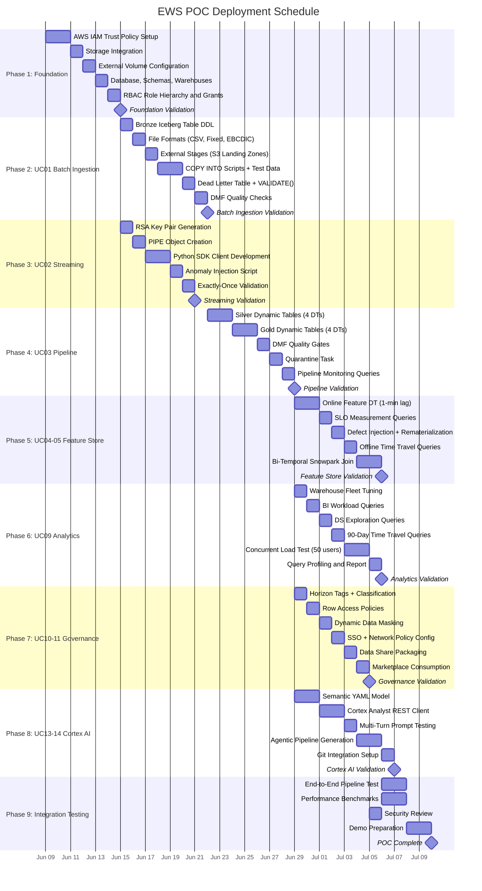

# EWS POC — Deployment Schedule and Work Breakdown

## Gantt Chart



---

## Work Breakdown Structure (WBS)

### Phase 1: Foundation Infrastructure

| WBS | Task | Deliverable | Dependencies | Resources |
|-----|------|-------------|--------------|-----------|
| 1.1 | AWS IAM Trust Policy | IAM Role with Snowflake trust | AWS Admin access | Cloud Ops |
| 1.2 | Storage Integration | `ews_s3_integration` object | 1.1 complete | Snowflake Admin |
| 1.3 | External Volume | `ews_iceberg_vol` (ALLOW_WRITES=TRUE) | 1.2 verified | Snowflake Admin |
| 1.4 | Database + Schemas | EWS_POC with 7 schemas | 1.3 verified | Data Engineer |
| 1.5 | Warehouse Fleet | 4 workload-specific warehouses | 1.4 complete | Data Engineer |
| 1.6 | RBAC Hierarchy | 6 functional roles + grants | 1.4 complete | Security Admin |

### Phase 2: UC01 — Batch Ingestion

| WBS | Task | Deliverable | Dependencies | Resources |
|-----|------|-------------|--------------|-----------|
| 2.1 | Bronze Table DDL | 4 Iceberg tables (txns, members, alerts, institutions) | Phase 1 | Data Engineer |
| 2.2 | File Format Definitions | 4 formats (delimited, fixed-width, EBCDIC, JSON) | 2.1 | Data Engineer |
| 2.3 | External Stages | 4 stages (one per file type) | 1.2, S3 paths confirmed | Data Engineer |
| 2.4 | Test Data Generation | Sample files in each format | 2.2, 2.3 | Data Engineer |
| 2.5 | COPY INTO Scripts | 3 ingestion scripts with ON_ERROR=CONTINUE | 2.1-2.4 | Data Engineer |
| 2.6 | Dead Letter Table | VALIDATE() extraction pipeline | 2.5 tested | Data Engineer |
| 2.7 | DMF Quality Checks | 5 DMFs attached to Bronze tables | 2.5 tested | Data Quality |

### Phase 3: UC02 — Real-Time Streaming

| WBS | Task | Deliverable | Dependencies | Resources |
|-----|------|-------------|--------------|-----------|
| 3.1 | Key Pair Authentication | RSA key pair + user config | Phase 1 | Security |
| 3.2 | Streaming Target Table | BRONZE.STREAMING_EVENTS Iceberg | 2.1 pattern | Data Engineer |
| 3.3 | PIPE Object | BRONZE.EWS_EVENT_PIPE | 3.2 | Data Engineer |
| 3.4 | Python SDK Client | Streaming producer (~30 lines) | 3.1, 3.3 | Developer |
| 3.5 | Anomaly Injection | Duplicate + late event script | 3.4 working | Developer |
| 3.6 | Validation Queries | Exactly-once + ordering proof | 3.5 executed | Data Engineer |

### Phase 4: UC03 — Medallion Pipeline

| WBS | Task | Deliverable | Dependencies | Resources |
|-----|------|-------------|--------------|-----------|
| 4.1 | Silver DTs (Cleanse) | 4 Dynamic Tables (INCREMENTAL) | Phase 2, Phase 3 | Data Engineer |
| 4.2 | Gold DTs (Aggregate) | 4 Dynamic Tables (INCREMENTAL) | 4.1 refreshing | Data Engineer |
| 4.3 | DMF Quality Gates | DMFs blocking zone promotion | 4.1, 4.2 | Data Quality |
| 4.4 | Quarantine Task | Snowflake Task for enforcement | 4.3 | Data Engineer |
| 4.5 | Monitoring Setup | Refresh history + alerting queries | 4.1, 4.2 | Platform Eng |

### Phase 5: UC04-05 — Feature Stores

| WBS | Task | Deliverable | Dependencies | Resources |
|-----|------|-------------|--------------|-----------|
| 5.1 | Online Feature DT | 1-minute lag Dynamic Table | Phase 4 complete | ML Engineer |
| 5.2 | SLO Measurement | p99 latency query (target: 1.5s) | 5.1 + streaming data | ML Engineer |
| 5.3 | Defect Injection | Bad data in stream | 5.1 running | ML Engineer |
| 5.4 | Rematerialization | ALTER DT REFRESH from Gold | 5.3 | ML Engineer |
| 5.5 | Offline Time Travel | AT(TIMESTAMP) queries | Phase 4, data age >1 day | ML Engineer |
| 5.6 | Bi-Temporal Join | Snowpark Python PIT join | 5.5 | ML Engineer |

### Phase 6: UC09 — Analytics Performance

| WBS | Task | Deliverable | Dependencies | Resources |
|-----|------|-------------|--------------|-----------|
| 6.1 | Warehouse Tuning | Query Acceleration enabled | Phase 1 warehouses | Platform Eng |
| 6.2 | BI Workload | 5 dashboard-style queries | Phase 4 Gold populated | Analyst |
| 6.3 | DS Workload | 5 ad-hoc exploration queries | Phase 4 Gold populated | Data Scientist |
| 6.4 | 90-Day Time Travel | Historical snapshot queries | Data age >1 day | Analyst |
| 6.5 | Concurrent Test | 50-user load test Python script | 6.2, 6.3 | Developer |
| 6.6 | Performance Report | QUERY_HISTORY analysis | 6.5 complete | Platform Eng |

### Phase 7: UC10-11 — Governance and Sharing

| WBS | Task | Deliverable | Dependencies | Resources |
|-----|------|-------------|--------------|-----------|
| 7.1 | Horizon Tags | SENSITIVITY + DATA_DOMAIN tags | Phase 4 tables exist | Security |
| 7.2 | Row Access Policies | Regional segmentation policy | 7.1 | Security |
| 7.3 | Data Masking | PII masking for non-privileged roles | 7.1 | Security |
| 7.4 | SSO + Network Policy | BI tool connectivity config | EWS IdP details | Security |
| 7.5 | Data Share | Gold tables packaged as share | Phase 4 Gold populated | Data Engineer |
| 7.6 | Marketplace | Vendor share mounted | Marketplace listing available | Data Engineer |

### Phase 8: UC13-14 — Cortex AI

| WBS | Task | Deliverable | Dependencies | Resources |
|-----|------|-------------|--------------|-----------|
| 8.1 | Semantic YAML | Model for 4 Gold tables | Phase 4 Gold schema finalized | AI Engineer |
| 8.2 | Cortex Analyst Client | Python REST API client | 8.1 staged | AI Engineer |
| 8.3 | Prompt Testing | 10+ NL queries validated | 8.2 | AI Engineer |
| 8.4 | Agentic Pipeline Gen | CORTEX.COMPLETE for DDL/DQ | Phase 4 schema | AI Engineer |
| 8.5 | Git Integration | Snowflake Git repo connected | GitHub PAT | DevOps |

### Phase 9: Integration and Demo

| WBS | Task | Deliverable | Dependencies | Resources |
|-----|------|-------------|--------------|-----------|
| 9.1 | End-to-End Test | Full pipeline: file to feature | Phases 2-5 complete | All |
| 9.2 | Performance Benchmark | Latency report under load | Phase 6 complete | Platform Eng |
| 9.3 | Security Review | RBAC + masking verified | Phase 7 complete | Security |
| 9.4 | Demo Preparation | Runbook + talking points | 9.1-9.3 | SA Team |
| 9.5 | POC Delivery | Final handoff to EWS | 9.4 | SA Team |

---

## Critical Path

The critical path runs through the longest dependency chain:

```
Foundation (6 days)
  → Batch Ingestion (8 days)
    → Pipeline (7 days)
      → Feature Store (7 days)
        → Integration Testing (4 days)
```

**Total critical path: ~32 working days**

Phases 6 (Analytics), 7 (Governance), and 8 (Cortex AI) can run in parallel with Phase 5 once Phase 4 completes, saving approximately 14 days of serial execution.

---

## Resource Requirements

| Role | Allocation | Phases |
|------|-----------|--------|
| Snowflake Solutions Architect | Full-time | All phases |
| Data Engineer | Full-time | Phases 1-5 |
| ML/AI Engineer | Part-time | Phases 5, 8 |
| Security/Compliance | Part-time | Phases 1, 7 |
| Cloud Operations (AWS) | Part-time | Phase 1 only |
| EWS Technical Contact | As-needed | Validation checkpoints |

---

## Milestone Checkpoints

| Milestone | Criteria | Exit Gate |
|-----------|----------|-----------|
| **Foundation Complete** | All infra verified, SYSTEM$VERIFY passes | Can create Iceberg tables |
| **Ingestion Proven** | Batch + streaming data landing in Bronze | Records queryable |
| **Pipeline Running** | Dynamic Tables refreshing, Gold populated | Target lag met |
| **Features Available** | Online (1-min) + Offline (time travel) working | SLO measured |
| **Analytics Scaled** | 50 concurrent queries, auto-scaling observed | Latency report |
| **Governance Active** | Tags, masking, RLS all enforced | Security audit pass |
| **AI Functional** | Cortex Analyst answering NL questions | Multi-turn demo |
| **POC Complete** | All use cases demonstrated end-to-end | EWS sign-off |

---

## Risk Register

| Risk | Impact | Likelihood | Mitigation |
|------|--------|-----------|------------|
| AWS IAM misconfiguration | Blocks Phase 1 | Medium | Pre-validate trust policy template |
| S3 permissions insufficient | Blocks all writes | Medium | Run SYSTEM$VERIFY early |
| Snowpipe Streaming SDK version | Blocks UC02 | Low | Pin SDK version, test early |
| Dynamic Table incremental not supported | Blocks UC03 | Low | Validate query patterns before build |
| Cortex Analyst model quality | Degrades UC13 | Medium | Use verified_queries in YAML |
| Data volume insufficient for perf test | Weakens UC09 | Medium | Pre-generate 100GB synthetic data |
| Network policy blocks BI tools | Blocks UC10 | Low | Coordinate IP ranges with EWS |
